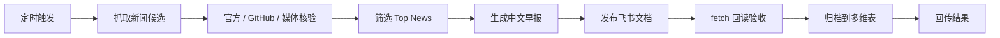

# daily-ai-agent-aigc-top-news

一个专门做 **AI / Agent / AIGC 每日早报** 的 Hermes skill。

它适合每天固定时间自动跑：抓取过去 24 小时的重要更新，核验来源，写成中文早报，发布到飞书文档，并可同步归档到飞书多维表。


## 它解决什么问题

每天看 AI 新闻很容易变成三件事：

- 信息太碎
- 来源真假混在一起
- Agent / AIGC 生图生视频 / 开源趋势经常漏看

这个 skill 把流程固定下来：先抓候选，再核验，再写早报，再发布和归档。

## 适合谁用

- 每天要看 AI / Agent / AIGC 进展的人
- 想把早报自动发到飞书团队空间的人
- 想追踪 coding agent、模型更新、开源工具链的人
- 想把日报沉淀进多维表，方便以后回查的人

## 核心能力

| 能力 | 说明 |
|---|---|
| 24 小时窗口 | 默认按 Asia/Shanghai 统计过去 24 小时 |
| 多源抓取 | Hacker News、GitHub、Hugging Face、官方站点、权威媒体等 |
| 强制核验 | 官方发布、GitHub release/PR、API/docs 优先 |
| AIGC 检查 | 每天检查生图、生视频、多模态创作工具更新 |
| GitHub Trending | 只作为“今日趋势信号”，不伪装成正式发布 |
| 指定项目检查 | 可强制检查某个仓库，比如 `NousResearch/hermes-agent` |
| 飞书发布 | 输出为飞书/Lark 原生文档 |
| 多维表归档 | 可写入飞书多维表，保留标题、Top3、摘要、链接等字段 |

## 工作流



## 依赖

基础依赖：

- Python 3
- `git`
- `lark-cli`，并完成飞书/Lark 登录授权
- [`news-aggregator-skill`](../news-aggregator-skill/)：抓取新闻候选
- [`feishu-lark-workflows`](../feishu-lark-workflows/)：飞书文档发布、回读、多维表字段检查
- [`ai-news-bitable-archive`](../ai-news-bitable-archive/)：归档日报到多维表

如果要完整跑飞书发布和多维表归档，需要准备：

```text
FEISHU_BITABLE_BASE_TOKEN=<你的多维表 app token>
FEISHU_BITABLE_TABLE_ID=<你的 table id>
FEISHU_FOLDER_TOKEN=<你的飞书云盘 folder token>
```

不要把这些 token 写进公开仓库。

## 快速开始

把 `SKILL.md` 放进 Hermes skills 目录后，在任务或 cron 中挂载：

```text
daily-ai-agent-aigc-top-news
news-aggregator-skill
feishu-lark-workflows
ai-news-bitable-archive
```

最小 cron prompt：

```text
任务：生成“过去24小时 AI / Agent / AIGC Top News 早报”，发布到飞书原生文档，并在发布成功后自动归档到飞书多维表。完成后把结果回传到当前聊天。

必须使用 daily-ai-agent-aigc-top-news skill。

固定要求：
1. 时间窗口：过去24小时，时区 Asia/Shanghai。
2. 必须检查 AI / Agent / coding agent / eval / workflow / toolchain / AIGC 生图生视频。
3. 必须检查 GitHub Trending Today；只能写成“今日趋势信号”。
4. 必须单独核查指定仓库：<owner>/<repo>。
5. 发布为飞书原生文档。
6. 创建后必须 docs +fetch 回读验收。
7. 如启用归档，必须按 record_id 回读验收。
8. 最终回复包含：文档标题、doc_url、bitable_url、record_id、3～6条摘要。
```

## 早报结构

默认生成结构：

```md
更新于：YYYY-MM-DD 08:00 CST

统计窗口：过去24小时

筛选口径：官方发布 / GitHub release 或 PR / 权威媒体 / 开源趋势信号。

## 最值得注意的 3 条

## 模型 / Agent 产品

## AIGC 生图 / 生视频

## 评测 / 基准 / 研究

## GitHub Trending / 开源趋势信号

## 开源项目 / Toolchain 信号

## 指定项目过去24小时更新

## 产业动态

## 一句话结论
```

## 关键规则

- 真实性优先，不硬凑条数
- GitHub Trending 只能写成趋势信号
- HN / 社交讨论只做辅助，不能当主证据
- 生图 / 生视频官方源每天都要查
- 指定项目必须单独查 release、commit、merged PR
- 飞书文档创建后必须回读验收
- 多维表归档后必须按 `record_id` 回读验收

## 常见坑

| 问题 | 处理 |
|---|---|
| 只看聚合器 | 聚合器只给线索，最终要看官方/GitHub/API 证据 |
| Trending 写成发布 | 错。只能写“今日趋势信号” |
| 飞书 Markdown 粘在一起 | 每个 `##` 前至少空一行 |
| 多维表 URL 字段写入失败 | URL 字段通常要 `{link, text}` 对象，不是裸字符串 |
| shell JSON 转义炸了 | 用 Python `subprocess.run([...])`，别手拼大 JSON |

## 文件说明

| 文件 | 作用 |
|---|---|
| [`SKILL.md`](./SKILL.md) | Hermes skill 主体 |
| [`templates/cron-prompt.zh.md`](./templates/cron-prompt.zh.md) | 可直接改造的定时任务 prompt |
| [`assets/daily-ai-agent-aigc-top-news-flow.svg`](./assets/daily-ai-agent-aigc-top-news-flow.svg) | 工作流示意图 |

## 一句话

如果你每天都要追 AI / Agent / AIGC，这个 skill 的价值就是：**少刷消息流，多看核验后的结论。**
