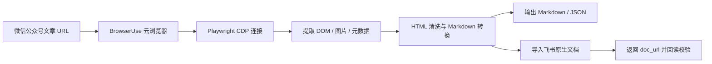

# wechat-article-browseruse

一个面向 **微信公众号文章抓取** 的独立小工具：
用 **BrowserUse 云浏览器 + Playwright CDP** 稳定打开 `mp.weixin.qq.com/s/...` 页面，提取正文，再按需发布为 **飞书原生文档**。

> 当前版本：**v0.2.0**
>
> 发布定位：**可独立运行的 early standalone release**


## 它能做什么

- 抓取微信公众号文章正文
- 输出为 Markdown 或 JSON
- 保留标题、作者、发布时间与正文图片
- 一键导入为飞书原生文档
- 返回 `doc_url` 并做回读校验

## 适合谁

- 想验证 BrowserUse 抓公众号是否稳定的人
- 想把公众号文章快速收进飞书的人
- 不想依赖本机 CamoFox，只想走 BrowserUse 云浏览器链路的人

## 工作流程



## 前置要求

### 系统依赖

请先确认本机已经安装：

- Python 3.10+
- `pip`
- `node` / `npm`
- `lark-cli`（如果你要发布到飞书）

### 环境变量

至少需要准备：

- `BROWSER_USE_API_KEY` 或 `BROWSERUSE_API_KEY`

可选默认值：

- `BROWSER_USE_PROXY_COUNTRY=hk`
- `BROWSER_USE_TIMEOUT=240`
- `BROWSER_USE_WAIT_MS=8000`

如果要发布到飞书，还需要你本机的 `lark-cli` 已完成登录，并具备文档导入/读取权限。

## 快速开始

### 1）安装依赖

```bash
cd wechat-article-browseruse
python3 -m venv .venv
source .venv/bin/activate
pip install -r requirements.txt
playwright install chromium
```

### 2）配置环境变量

```bash
cp .env.example .env
# 然后填入你的 BrowserUse API key
```

### 3）先跑 smoke test

```bash
bash scripts/smoke-test.sh
```

### 4）抓取一篇公众号文章

```bash
python3 scripts/run.py fetch \
  "https://mp.weixin.qq.com/s/xxxxxxxxxxxxxxxx"
```

### 5）发布到飞书原生文档

```bash
python3 scripts/run.py publish-feishu \
  "https://mp.weixin.qq.com/s/xxxxxxxxxxxxxxxx"
```

如果要直接放到指定文件夹：

```bash
python3 scripts/run.py publish-feishu \
  "https://mp.weixin.qq.com/s/xxxxxxxxxxxxxxxx" \
  --folder-token <folder_token>
```

## 常用命令

### 抓成 Markdown

```bash
python3 scripts/run.py fetch \
  "https://mp.weixin.qq.com/s/xxxxxxxxxxxxxxxx"
```

### 抓成 JSON

```bash
python3 scripts/run.py fetch \
  "https://mp.weixin.qq.com/s/xxxxxxxxxxxxxxxx" \
  --format json \
  --include-images
```

### 保存到本地文件

```bash
python3 scripts/run.py fetch \
  "https://mp.weixin.qq.com/s/xxxxxxxxxxxxxxxx" \
  --save /tmp/wechat-article.md
```

### 发布到飞书并输出完整 JSON 结果

```bash
python3 scripts/run.py publish-feishu \
  "https://mp.weixin.qq.com/s/xxxxxxxxxxxxxxxx" \
  --json
```

## 目录结构

```text
wechat-article-browseruse/
├── README.md
├── SKILL.md
├── requirements.txt
├── .env.example
├── scripts/
│   ├── run.py
│   ├── fetch_wechat_article.py
│   ├── publish_wechat_article_to_feishu.py
│   └── smoke-test.sh
├── tests/
│   ├── test_fetch_wechat_article.py
│   └── test_publish_wechat_article_to_feishu.py
└── assets/
    └── workflow-preview-v2.svg
```

## 已验证的路径

当前这条链路已经完成过真实验证：

- BrowserUse 抓取微信公众号文章
- 导出 Markdown / JSON
- 导入飞书原生文档
- 飞书回读校验通过

## 已知边界

- 这是 **微信公众号正文抓取器**，不是通用网页抽取器
- 复杂排版转成 Markdown 时，仍可能有轻微格式损失
- 飞书发布依赖 `lark-cli` 当前登录身份的 scope 是否完整
- 发布到飞书时，图片与表格的最终样式以飞书导入器解释为准

## 测试

```bash
source .venv/bin/activate
pytest tests -q
```

## 故障排查

### 1）提示缺少 BrowserUse API key

确认 `.env` 或当前 shell 中已经设置：

```bash
export BROWSER_USE_API_KEY=your_key
```

### 2）发布飞书时报权限错误

通常是 `lark-cli` 当前用户身份缺少文档导入或读取 scope。重新登录并补齐 scope。

### 3）`lark-cli drive +import` 提示文件路径不安全

这个项目内部已经用“相对路径 + 临时目录”处理过这个坑。你自己扩展脚本时，别直接把绝对路径塞给 `--file`。
