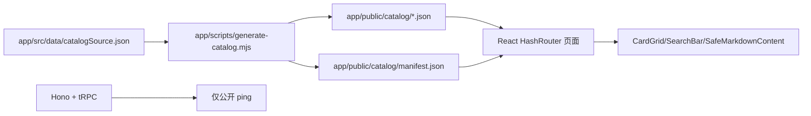

# PromptForge 架构债务对抗性审计与执行计划

## 0. 证据边界

本轮结论基于当前本地仓库、合并后的 `main`、本地构建、测试、smoke、授权远端部署、生产只读检查和公网 Chrome 验收。

- 本地合并：已执行，`main` 合并 `codex/integration-promptforge-merge-20260705`，合并提交 `ae00c4d`。
- 本地验证：`npm run verify` 通过，`npm run smoke:e2e` 本地生产形态通过；2026-07-08 再次执行 `npm run verify` 通过。
- 本地 Chrome 验收：已用本机 Google Chrome 访问 `http://127.0.0.1:3000/`，分类路由、技能页搜索/清除/加载更多/展开/收藏均通过，console error/warning 为 0。
- 部署预检：`bash deploy/deploy.sh --dry-run --smoke` 通过；`docker compose -f deploy/docker-compose.yml config --services` 通过，服务为 `app`。
- 本地容器验收：`docker build --target production -t promptforge-app:local-preflight app` 通过；临时容器 `127.0.0.1:3001` smoke 通过后已删除。
- 远端部署：已执行 `bash deploy/deploy.sh`，最近一次远端镜像 `sha256:9973721921493557b6fcd797e5b036355f0d73c29137e218b1f8db34dcd8e196`，`promptforge_app` 为 `healthy`。
- 生产容器验收：经临时 SSH tunnel `127.0.0.1:3010 -> promptforge_app:3000` 完成 smoke 和本机 Chrome 路由验收；公网放通后又完成 `https://kg.lute-tlz-dddd.top/` 生产 smoke。
- 公网入口状态：`https://kg.lute-tlz-dddd.top/` 已返回 `200`，HTML title 为 `灵词 PromptForge`，公网 Chrome 分类页和技能页关键交互验收通过。
- 未执行：远端 push、GitHub PR、provider call、数据库写入、nginx auth gate 配置修改。
- 生产状态：应用容器已部署并健康；公网 `kg` 入口已可无登录访问；co-host 域名仍按各自策略返回 `200` 或 `302`。

## 1. 当前架构事实

### 1.1 运行时主链路

事实：

- 当前公开站点是 static-first read-only。
- 前端主要通过 `fetch('/catalog/...')` 加载静态 JSON。
- 公开 tRPC 根路由只挂载 `ping`，旧 DB-backed list/count/getById routers 未挂载到 public `appRouter`。
- `SafeMarkdownContent` 替代 raw HTML 注入路径，测试覆盖 `dangerouslySetInnerHTML` 回归。
- catalog 合同由 `catalog-source-contract.json`、schema、`catalog:check` 和 `dataUtils.test.ts` 共同约束。

### 1.2 部署链路

事实：

- `deploy/docker-compose.yml` 当前为 app-only compose，服务列表为 `app`。
- `deploy/deploy.sh` 通过 rsync 同步 `app/`、compose 和 `.env.prod`，远端 build 后重启 `promptforge_app`。
- `--seed` 被显式拒绝，避免把 static-first 部署误解成数据库写入。
- `.env.prod`、`secrets.env`、`*.pem`、`*.key` 已由 `.gitignore` 捕获。

边界：

- `deploy.sh` 是真实远端 side effect，不应在没有明确生产授权时执行。
- 本轮只完成语法和 compose config 预检，不代表生产部署完成。

## 2. 分支合并分析

事实：

- `codex/integration-promptforge-merge-20260705` 已包含：
  - `codex/audit-remediation-phase0`
  - `codex/debt-phase0-risk-stopgap`
  - 最新 prompt 增量提交 `1a76026`
- 当前本地 `main` 已通过 `--no-ff` 合并该集成分支。
- 合并后 `main` 相对 `origin/main` ahead 22；未 push。
- 原有未跟踪文件仍保留，未删除、未暂存。

## 3. 对抗性审计结论

| 等级 | 分类 | 脆弱点 | 证据 | 当前状态 |
|---|---|---|---|---|
| P0 | 验收脆弱点 | `smoke-e2e` 硬编码 851/201，catalog 增量后会误报 | `app/scripts/smoke-e2e.mjs` 原固定 counts | 已修：改为读取 manifest |
| P0 | 文档债务 | README/app README/deploy workflow 仍引用旧 count 或 `staticData.ts` | `rg "851|201|staticData"` | 已修活跃文档；历史记录保留并标注 |
| P1 | 运行时 fallback 债务 | `catalogMeta.ts` 的首页/加载态 fallback count 会漂移 | `CATEGORY_COUNTS.prompt` 原为 201 | 已修到 202，并加测试锁定 |
| P1 | 工程债务 | 本地 `node_modules` 与合并后 lockfile 不一致，导致 smoke 找不到 Playwright | 首次 `npm run smoke:e2e` 未进入页面 | 已通过 `npm install` 同步依赖 |
| P1 | 架构债务 | DB routers、DB import scripts 和 static-first 生产链路共存 | `app/api/*-router.ts` 存在但未挂载 | 保留为未来 DB-backed 路线，需继续隔离 |
| P1 | 部署债务 | `deploy.sh` 缺少 side-effect-free dry-run 模式 | 当前 deploy 入口直接 SSH/rsync/remote build | 待办 |
| P1 | 迁移风险 | `db:push` 仍作为 npm script 暴露 | `app/package.json` | 待办：加本地/显式确认 guard |
| P2 | 目录治理 | 根目录有未跟踪 `.codegraph/`、`.kiro/`、`.sisyphus/`、旧草稿 | `git status --short` | 未处理；删除/归档需另行确认 |
| P2 | 文档债务 | 历史图谱中仍有 `staticData.ts` 和旧计数 | `docs/architecture/...` | 已标注为历史快照，不作为当前事实 |

## 4. 推荐方案

### 路线 A：继续 static-first read-only 稳定化

推荐作为当前主线。理由：

- 当前产品价值来自可检索 catalog 和内容资产，而不是在线编辑。
- public API 已收敛到只读 ping，攻击面较小。
- catalog 增量可以通过 JSON 源、生成器、manifest、smoke 和部署脚本闭环。

### 路线 B：DB-backed 管理发布系统

只在明确要上线管理员新增/审核/发布后启动。进入条件：

- 先有认证、授权、CSRF、审计日志、限流和回滚设计。
- 用 migration 替代生产 `db:push`。
- Admin API、deploy-worker、catalog versioning 与 static public app 分离。

当前不建议直接实现路线 B。

## 5. TODO List

| ID | 优先级 | TODO | 状态 | 验收 |
|---|---|---|---|---|
| T0 | P0 | 本地合并集成分支到 `main` | Done | `git status` 显示 `main...origin/main [ahead 22]` |
| T1 | P0 | 修复 catalog count 漂移：README、app README、deploy README、workflow、`catalogMeta.ts` | Done | `rg "851|201|staticData"` 仅剩历史记录和兼容脚本名 |
| T2 | P0 | 改造 smoke：从 manifest 动态读取 catalog count | Done | 本地 `npm run smoke:e2e` 通过 |
| T3 | P0 | 对 count fallback 加测试，防止下次增量漏改 | Done | `npm run test` 通过 |
| T4 | P1 | 生成本审计计划与执行清单 | Done | 本文档落盘 |
| T5 | P1 | 给 `deploy.sh` 增加 `--dry-run` 或 preflight-only 模式 | Done | 无 SSH side effect 下可验证 rsync/remote command plan |
| T6 | P1 | 给 `db:push` 增加本地 guard 或改名为显式危险命令 | Done | 误运行不会触达生产 DSN |
| T7 | P1 | 决策 DB routers：继续归档、加 deprecated 标注，或进入 DB-backed 设计 | Done | public API boundary test 仍通过 |
| T8 | P2 | 对 `.codegraph/.kiro/.sisyphus` 和旧草稿制定归档/保留清单 | Blocked-by-approval | 删除或移动前需确认 |
| T9 | P2 | 生产 read-only smoke | Blocked-by-approval | 需授权访问生产域名与 co-host 检查 |
| T10 | P2 | 远端部署 | Blocked-by-approval | 需明确 push/SSH/production 授权 |

## 5.1 下一批 TODO（2026-07-08 执行）

| ID | 优先级 | TODO | 状态 | 验收 |
|---|---|---|---|---|
| N1 | P1 | `deploy.sh --dry-run`：输出远端同步/构建/启动/smoke 计划，但不产生外部副作用 | Done | `bash deploy/deploy.sh --dry-run --smoke` 退出 0，输出 no-side-effect 边界 |
| N2 | P1 | `db:push` guard：默认阻断，只有 local-only 确认和 localhost DSN 才允许 | Done | `node scripts/guard-db-push.mjs` 无确认时退出 1；Vitest 锁定 |
| N3 | P1 | 旧 DB-backed routers 加非公开边界标记 | Done | `ops-boundary.test.ts` 检查 `DB_BACKED_ROUTE_NOT_PUBLIC` |
| N4 | P1 | 文档同步 `--dry-run` 与 guarded `db:push` 用法 | Done | `npm run docs:check` |
| N5 | P2 | 本地 Docker production image build | Done | 临时补充 Docker.app credential helper PATH 后，`docker build --target production -t promptforge-app:local-preflight app` 通过 |
| N6 | P2 | 本机 Google Chrome 产品验收 | Done | 六个 hash 分类路由、技能页搜索/清除/加载更多/展开/收藏通过，console error/warning 为 0 |
| N7 | P2 | 本地临时容器部署验收 | Done | `promptforge-app:local-preflight` 映射到 `127.0.0.1:3001`，ping 与 smoke 通过，容器已删除 |
| N8 | P2 | 生产无会话 read-only smoke | Done | `https://kg.lute-tlz-dddd.top/` 返回 `200`，smoke 报告 `tmp/outputs/smoke-e2e-report-20260708094838.json` |
| N9 | P2 | 远端 app 部署 | Done | `bash deploy/deploy.sh` 完成 rsync、远端 build、容器重建和容器内 ping |
| N10 | P2 | 已部署容器验收 | Done | 临时 SSH tunnel smoke 通过；本机 Chrome 验证首页和 6 个分类路由 |
| N11 | P2 | 公网入口 auth gate 决策 | Done-external | 用户确认已放通；本轮仅复核 `kg` 入口 `200`，未改 nginx 配置 |
| N12 | P2 | Git push / PR | Blocked-by-approval | 本地 `main` 仍 ahead `origin/main`，未 push |
| N13 | P2 | 远端再部署并复核镜像 | Done | 备份 `/opt/promptforge/.deploy-backups/app-compose-predeploy-20260708174531.tgz`；镜像 `sha256:9973721921493557b6fcd797e5b036355f0d73c29137e218b1f8db34dcd8e196` |
| N14 | P2 | 公网 `kg` smoke | Done | `PROMPTFORGE_SMOKE_BASE_URL=https://kg.lute-tlz-dddd.top/ PROMPTFORGE_SMOKE_CHECK_COHOSTS=0 PROMPTFORGE_SMOKE_SCREENSHOTS=0 npm run smoke:e2e` 通过 |
| N15 | P2 | 本机 Chrome 公网验收 | Done | `https://kg.lute-tlz-dddd.top/` 分类页、技能页加载更多/搜索/筛选通过，console issue count 为 0 |
| N16 | P3 | 首页聚合统计口径复核 | Open | Chrome 观察到首页 `总条目` 展示 694，而 manifest 总量为 852；需确认是展示口径还是遗漏 |

## 6. 本轮执行记录

已执行：

1. 本地合并 `codex/integration-promptforge-merge-20260705` 到 `main`。
2. 修复 count 和 `catalogSource.json` 文档漂移。
3. `smoke-e2e` 从 manifest 动态获取 count。
4. `seed-full.ts` 改为动态输出 source record 总数。
5. 同步依赖后完成本地 smoke。
6. 完成本地 verify 和部署配置预检。
7. 新增 `deploy.sh --dry-run`，形成 no-side-effect 部署计划预检。
8. 新增 `guard-db-push.mjs`，默认阻断 `db:push`，只允许 local-only + localhost。
9. 给旧 DB-backed routers 加 `DB_BACKED_ROUTE_NOT_PUBLIC` 边界标记，并用 ops 边界测试锁定。
10. 使用本机 Google Chrome 完成本地产品验收，覆盖首页、六个分类路由和技能页关键交互。
11. 启动本机 Docker Desktop 后完成 production image build，并用临时容器完成本地部署 smoke。
12. 生产部署前创建远端 app/compose 备份：`/opt/promptforge/.deploy-backups/app-compose-predeploy-20260708173042.tgz`。
13. 执行 `bash deploy/deploy.sh`，完成远端 rsync、Docker build、`promptforge_app` 重建和容器内 ping。
14. 复核远端 `promptforge_app` 为 `healthy`，`ai_video_nginx` 到 `promptforge_app:3000` 的 ping 通过，`nginx -t` 通过。
15. 发现公网 `kg` 无会话入口仍由 `/etc/nginx/auth_gate.conf` 保护，返回 portal login `302`。
16. 通过临时 SSH tunnel 和本机 Chrome 完成已部署生产容器的只读验收；隧道已关闭。
17. 用户确认公网入口已放通后，再次执行 `bash deploy/deploy.sh`，部署前备份 `/opt/promptforge/.deploy-backups/app-compose-predeploy-20260708174531.tgz`，完成远端 build 和 `promptforge_app` 重建。
18. 复核 `promptforge_app` 为 `healthy`，镜像为 `sha256:9973721921493557b6fcd797e5b036355f0d73c29137e218b1f8db34dcd8e196`；容器内 ping、nginx 到 app ping、`nginx -t` 均通过。
19. 公网 `https://kg.lute-tlz-dddd.top/` 返回 `200`，页面 title 为 `灵词 PromptForge`，加载资产为 `assets/index-CYjfNfiH.js` 和 `assets/index-B5E8ccmS.css`。
20. 公网 smoke 通过，报告写入 `tmp/outputs/smoke-e2e-report-20260708094838.json`。
21. 使用本机 Google Chrome 完成公网可见验收：六个分类页渲染 48 张卡片，无横向溢出；技能页加载更多、搜索 `amazon`、跨境电商筛选通过；console issue count 为 0。

## 7. 验收证据

| 命令 | 结果 | 证据等级 |
|---|---|---|
| `npm run verify` | 通过 | local validation |
| `PROMPTFORGE_SMOKE_SCREENSHOTS=0 npm run smoke:e2e` | 通过；生产本地 server，co-host 检查因本地 host 跳过 | local smoke |
| `bash -n deploy/deploy.sh` | 通过 | deploy preflight |
| `/usr/local/bin/docker compose -f deploy/docker-compose.yml config --services` | 通过；服务为 `app` | deploy preflight |
| `git diff --check` | 通过 | local validation |
| `bash deploy/deploy.sh --dry-run --smoke` | 通过；无 SSH/rsync/远端 Docker/生产 smoke/provider call | L2-fixture-or-dry-run |
| 本机 Google Chrome 产品验收 | 通过；`/`、`#/prompts`、`#/skills`、`#/hooks`、`#/mcp`、`#/agents`、`#/github` 路由稳定，技能页交互通过，console error/warning 为 0 | local browser acceptance |
| `PATH="/Applications/Docker.app/Contents/Resources/bin:$PATH" docker pull node:20-alpine` | 通过；修复当前 shell 缺少 Docker credential helper 的本地环境问题 | local deploy preflight |
| `PATH="/Applications/Docker.app/Contents/Resources/bin:$PATH" docker build --target production -t promptforge-app:local-preflight app` | 通过；完成 production target 镜像构建 | local deploy preflight |
| `PROMPTFORGE_SMOKE_BASE_URL=http://127.0.0.1:3001/ PROMPTFORGE_SMOKE_SCREENSHOTS=0 npm run smoke:e2e` | 通过；临时本地容器 smoke 11 pass / 1 skip / 0 fail，容器已删除 | local container acceptance |
| `bash deploy/deploy.sh` | 通过；远端 build 输出 catalog count 202/314/80/80/81/95，`promptforge_app` 重建并容器内 ping 通过 | authorized live deploy |
| 远端容器健康复核 | 通过；`promptforge_app` 为 `healthy`，镜像为 `sha256:ad2d3515137a7f7592a2bd5517468b2799a0c62d41a0ff56194c4a0321a27c7d` | production read-only check |
| `docker exec ai_video_nginx curl http://promptforge_app:3000/api/trpc/ping?...` | 通过；nginx 容器到 app 容器链路返回 `ok=true` | production read-only check |
| `docker exec ai_video_nginx nginx -t` | 通过 | production read-only check |
| `curl https://kg.lute-tlz-dddd.top/` | 返回 portal login `302`；说明公网无会话入口受 auth gate 保护 | production public-entry boundary |
| `PROMPTFORGE_SMOKE_BASE_URL=http://127.0.0.1:3010/ PROMPTFORGE_SMOKE_SCREENSHOTS=0 npm run smoke:e2e` | 通过；临时 SSH tunnel 指向已部署生产容器，报告 `tmp/outputs/smoke-e2e-report-20260708093332.json` | production container acceptance |
| 本机 Google Chrome 访问 `http://127.0.0.1:3010/` | 通过；首页和 6 个分类路由渲染，计数一致，console issue count 为 0 | production container browser acceptance |
| `bash deploy/deploy.sh` | 通过；最近一次远端镜像为 `sha256:9973721921493557b6fcd797e5b036355f0d73c29137e218b1f8db34dcd8e196`，容器内 ping 通过 | authorized live deploy |
| 远端容器健康复核 | 通过；`promptforge_app` 为 `healthy`，`ai_video_nginx` 到 app ping 返回 `ok=true`，`nginx -t` 通过，`/opt/promptforge/.env.prod` 权限为 `600` | production read-only check |
| `curl https://kg.lute-tlz-dddd.top/` | 返回 `200`；HTML title 为 `灵词 PromptForge`，JS/CSS 资产可访问 | production public-entry check |
| `PROMPTFORGE_SMOKE_BASE_URL=https://kg.lute-tlz-dddd.top/ PROMPTFORGE_SMOKE_CHECK_COHOSTS=0 PROMPTFORGE_SMOKE_SCREENSHOTS=0 npm run smoke:e2e` | 通过；报告 `tmp/outputs/smoke-e2e-report-20260708094838.json` | production public smoke |
| 本机 Google Chrome 访问 `https://kg.lute-tlz-dddd.top/` | 通过；分类页、技能页加载更多、搜索、筛选均通过，console issue count 为 0 | production public browser acceptance |
| co-host 域名只读状态检查 | `video` 与根域为 `200`，`mkt` 和 `voc` 返回各自登录/应用跳转 `302` | co-host boundary check |

## 8. 残余风险

- 首页聚合统计口径需复核：公网 Chrome 观察到首页 `总条目` 为 694，而 catalog manifest 总量为 852；分类页计数和 smoke manifest 校验均通过。
- 本轮没有 push，远端 Git 和本地 `main` 不一致；生产是 rsync 部署的本地 `main` 工作树内容。
- 本轮没有清理未跟踪目录和草稿，避免误删用户资产。
- 旧 DB routers 仍保留，虽然未挂载到 public API，已加非公开标记；进入 DB-backed 路线前仍需认证、限流、审计和 migration 方案。
- 本机 Docker build 依赖 Docker Desktop daemon、Docker registry 可用性和 Docker.app credential helper PATH；本轮已临时补 PATH 完成构建，但这仍是本机环境前置条件。
