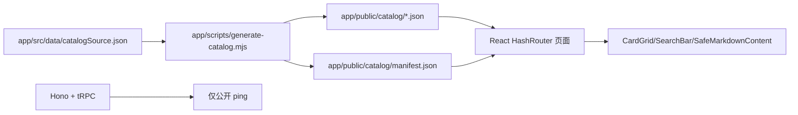

# PromptForge 架构债务对抗性审计与执行计划

## 0. 证据边界

本轮结论只基于当前本地仓库、合并后的 `main`、本地构建、测试、smoke 和部署预检。

- 本地合并：已执行，`main` 合并 `codex/integration-promptforge-merge-20260705`，合并提交 `ae00c4d`。
- 本地验证：`npm run verify` 通过，`npm run smoke:e2e` 本地生产形态通过。
- 部署预检：`bash -n deploy/deploy.sh` 通过，`docker compose -f deploy/docker-compose.yml config --services` 通过，服务为 `app`。
- 未执行：远端 push、GitHub PR、生产 SSH 部署、生产域名 smoke、provider call、数据库写入。
- 生产状态：未做新鲜 production read-only 复核；不能把本地 smoke 说成生产已验收。

## 1. 当前架构事实

### 1.1 运行时主链路

事实：

- 当前公开站点是 static-first read-only。
- 前端主要通过 `fetch('/catalog/...')` 加载静态 JSON。
- 公开 tRPC 根路由只挂载 `ping`，旧 DB-backed list/count/getById routers 未挂载到 public `appRouter`。
- `SafeMarkdownContent` 替代 raw HTML 注入路径，测试覆盖 `dangerouslySetInnerHTML` 回归。
- catalog 合同由 `catalog-source-contract.json`、schema、`catalog:check` 和 `dataUtils.test.ts` 共同约束。

### 1.2 部署链路

事实：

- `deploy/docker-compose.yml` 当前为 app-only compose，服务列表为 `app`。
- `deploy/deploy.sh` 通过 rsync 同步 `app/`、compose 和 `.env.prod`，远端 build 后重启 `promptforge_app`。
- `--seed` 被显式拒绝，避免把 static-first 部署误解成数据库写入。
- `.env.prod`、`secrets.env`、`*.pem`、`*.key` 已由 `.gitignore` 捕获。

边界：

- `deploy.sh` 是真实远端 side effect，不应在没有明确生产授权时执行。
- 本轮只完成语法和 compose config 预检，不代表生产部署完成。

## 2. 分支合并分析

事实：

- `codex/integration-promptforge-merge-20260705` 已包含：
  - `codex/audit-remediation-phase0`
  - `codex/debt-phase0-risk-stopgap`
  - 最新 prompt 增量提交 `1a76026`
- 当前本地 `main` 已通过 `--no-ff` 合并该集成分支。
- 合并后 `main` 相对 `origin/main` ahead 22；未 push。
- 原有未跟踪文件仍保留，未删除、未暂存。

## 3. 对抗性审计结论

| 等级 | 分类 | 脆弱点 | 证据 | 当前状态 |
|---|---|---|---|---|
| P0 | 验收脆弱点 | `smoke-e2e` 硬编码 851/201，catalog 增量后会误报 | `app/scripts/smoke-e2e.mjs` 原固定 counts | 已修：改为读取 manifest |
| P0 | 文档债务 | README/app README/deploy workflow 仍引用旧 count 或 `staticData.ts` | `rg "851|201|staticData"` | 已修活跃文档；历史记录保留并标注 |
| P1 | 运行时 fallback 债务 | `catalogMeta.ts` 的首页/加载态 fallback count 会漂移 | `CATEGORY_COUNTS.prompt` 原为 201 | 已修到 202，并加测试锁定 |
| P1 | 工程债务 | 本地 `node_modules` 与合并后 lockfile 不一致，导致 smoke 找不到 Playwright | 首次 `npm run smoke:e2e` 未进入页面 | 已通过 `npm install` 同步依赖 |
| P1 | 架构债务 | DB routers、DB import scripts 和 static-first 生产链路共存 | `app/api/*-router.ts` 存在但未挂载 | 保留为未来 DB-backed 路线，需继续隔离 |
| P1 | 部署债务 | `deploy.sh` 缺少 side-effect-free dry-run 模式 | 当前 deploy 入口直接 SSH/rsync/remote build | 待办 |
| P1 | 迁移风险 | `db:push` 仍作为 npm script 暴露 | `app/package.json` | 待办：加本地/显式确认 guard |
| P2 | 目录治理 | 根目录有未跟踪 `.codegraph/`、`.kiro/`、`.sisyphus/`、旧草稿 | `git status --short` | 未处理；删除/归档需另行确认 |
| P2 | 文档债务 | 历史图谱中仍有 `staticData.ts` 和旧计数 | `docs/architecture/...` | 已标注为历史快照，不作为当前事实 |

## 4. 推荐方案

### 路线 A：继续 static-first read-only 稳定化

推荐作为当前主线。理由：

- 当前产品价值来自可检索 catalog 和内容资产，而不是在线编辑。
- public API 已收敛到只读 ping，攻击面较小。
- catalog 增量可以通过 JSON 源、生成器、manifest、smoke 和部署脚本闭环。

### 路线 B：DB-backed 管理发布系统

只在明确要上线管理员新增/审核/发布后启动。进入条件：

- 先有认证、授权、CSRF、审计日志、限流和回滚设计。
- 用 migration 替代生产 `db:push`。
- Admin API、deploy-worker、catalog versioning 与 static public app 分离。

当前不建议直接实现路线 B。

## 5. TODO List

| ID | 优先级 | TODO | 状态 | 验收 |
|---|---|---|---|---|
| T0 | P0 | 本地合并集成分支到 `main` | Done | `git status` 显示 `main...origin/main [ahead 22]` |
| T1 | P0 | 修复 catalog count 漂移：README、app README、deploy README、workflow、`catalogMeta.ts` | Done | `rg "851|201|staticData"` 仅剩历史记录和兼容脚本名 |
| T2 | P0 | 改造 smoke：从 manifest 动态读取 catalog count | Done | 本地 `npm run smoke:e2e` 通过 |
| T3 | P0 | 对 count fallback 加测试，防止下次增量漏改 | Done | `npm run test` 通过 |
| T4 | P1 | 生成本审计计划与执行清单 | Done | 本文档落盘 |
| T5 | P1 | 给 `deploy.sh` 增加 `--dry-run` 或 preflight-only 模式 | Todo | 无 SSH side effect 下可验证 rsync/remote command plan |
| T6 | P1 | 给 `db:push` 增加本地 guard 或改名为显式危险命令 | Todo | 误运行不会触达生产 DSN |
| T7 | P1 | 决策 DB routers：继续归档、加 deprecated 标注，或进入 DB-backed 设计 | Todo | public API boundary test 仍通过 |
| T8 | P2 | 对 `.codegraph/.kiro/.sisyphus` 和旧草稿制定归档/保留清单 | Blocked-by-approval | 删除或移动前需确认 |
| T9 | P2 | 生产 read-only smoke | Blocked-by-approval | 需授权访问生产域名与 co-host 检查 |
| T10 | P2 | 远端部署 | Blocked-by-approval | 需明确 push/SSH/production 授权 |

## 6. 本轮执行记录

已执行：

1. 本地合并 `codex/integration-promptforge-merge-20260705` 到 `main`。
2. 修复 count 和 `catalogSource.json` 文档漂移。
3. `smoke-e2e` 从 manifest 动态获取 count。
4. `seed-full.ts` 改为动态输出 source record 总数。
5. 同步依赖后完成本地 smoke。
6. 完成本地 verify 和部署配置预检。

## 7. 验收证据

| 命令 | 结果 | 证据等级 |
|---|---|---|
| `npm run verify` | 通过 | local validation |
| `PROMPTFORGE_SMOKE_SCREENSHOTS=0 npm run smoke:e2e` | 通过；生产本地 server，co-host 检查因本地 host 跳过 | local smoke |
| `bash -n deploy/deploy.sh` | 通过 | deploy preflight |
| `/usr/local/bin/docker compose -f deploy/docker-compose.yml config --services` | 通过；服务为 `app` | deploy preflight |
| `git diff --check` | 通过 | local validation |

## 8. 残余风险

- 本轮没有生产 read-only smoke，线上域名是否已经包含本地合并结果仍未知。
- 本轮没有 push，远端 Git 和本地 `main` 不一致。
- 本轮没有执行生产部署；`deploy.sh` 仍是真实远端 side effect，需要授权。
- 本轮没有清理未跟踪目录和草稿，避免误删用户资产。
- `db:push` 和旧 DB routers 仍保留，虽然未挂载到 public API，但仍是架构噪声。
